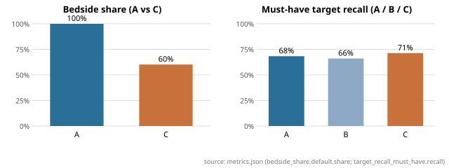

# Bedside Brief — evaluation report

Run: model `gpt-4.1`, git head `f2c25874bcd5000e4870a0ac2f8fa4f16c0c0ed3`, frozen commits ['39a698e5e79a5b6eddebf090caa3f6c8a1b16f7b'], updated 2026-09-11T11:31:36+00:00.<!-- manifest.json -->
Provenance: every number below is followed by an HTML comment `<!-- file#json.path -->`; relative files resolve inside `eval/runs/20260911T102303Z-safety-fix`.

## Benchmark and store

- Cases: 36<!-- metrics.json#cases.base --> base, 36<!-- metrics.json#cases.perturbation_pairs --> perturbation pairs, 36<!-- metrics.json#cases.noise_variants --> noise variants (108<!-- metrics.json#cases.inputs --> inputs).
- Records: 153<!-- metrics.json#store.verified --> verified of 153<!-- metrics.json#store.extracted --> extracted; not-quantified share 24.2%<!-- metrics.json#store.not_quantified_share -->.
- Library coverage: 83.7%<!-- metrics.json#store.library_coverage.coverage --> (216<!-- metrics.json#store.library_coverage.mapped_to_verified --> of 258<!-- metrics.json#store.library_coverage.targets --> targets map to a verified record).

## Headline (A vs C)

| Metric | A Bedside Brief | B Retrieval-only | C Generic LLM |
|---|---|---|---|
| Bedside share [default] | 100.0%<!-- metrics.json#arms.A.bedside_share.default.share --> | 100.0%<!-- metrics.json#arms.B.bedside_share.default.share --> | 60.1%<!-- metrics.json#arms.C.bedside_share.default.share --> |
| Bedside share [ecg_bedside] | 100.0%<!-- metrics.json#arms.A.bedside_share.ecg_bedside.share --> | 100.0%<!-- metrics.json#arms.B.bedside_share.ecg_bedside.share --> | 64.5%<!-- metrics.json#arms.C.bedside_share.ecg_bedside.share --> |
| Bedside share [mar_offbedside] | 100.0%<!-- metrics.json#arms.A.bedside_share.mar_offbedside.share --> | 100.0%<!-- metrics.json#arms.B.bedside_share.mar_offbedside.share --> | 58.5%<!-- metrics.json#arms.C.bedside_share.mar_offbedside.share --> |
| Must-have target recall | 68.3%<!-- metrics.json#arms.A.target_recall_must_have.recall --> | 66.0%<!-- metrics.json#arms.B.target_recall_must_have.recall --> | 71.3%<!-- metrics.json#arms.C.target_recall_must_have.recall --> |
| &nbsp;&nbsp;must-have recall [quantified] | 70.1%<!-- metrics.json#arms.A.target_recall_must_have.strata.quantified.recall --> | 66.7%<!-- metrics.json#arms.B.target_recall_must_have.strata.quantified.recall --> | 72.6%<!-- metrics.json#arms.C.target_recall_must_have.strata.quantified.recall --> |
| &nbsp;&nbsp;must-have recall [not_quantified] | 88.1%<!-- metrics.json#arms.A.target_recall_must_have.strata.not_quantified.recall --> | 90.5%<!-- metrics.json#arms.B.target_recall_must_have.strata.not_quantified.recall --> | 69.0%<!-- metrics.json#arms.C.target_recall_must_have.strata.not_quantified.recall --> |
| &nbsp;&nbsp;must-have recall [unmapped] | 22.2%<!-- metrics.json#arms.A.target_recall_must_have.strata.unmapped.recall --> | 22.2%<!-- metrics.json#arms.B.target_recall_must_have.strata.unmapped.recall --> | 63.0%<!-- metrics.json#arms.C.target_recall_must_have.strata.unmapped.recall --> |
| Target recall (all) | 51.6%<!-- metrics.json#arms.A.target_recall_all.recall --> | 51.4%<!-- metrics.json#arms.B.target_recall_all.recall --> | 62.3%<!-- metrics.json#arms.C.target_recall_all.recall --> |
| Unsupported quantitative claim rate | 0.0%<!-- metrics.json#arms.A.unsupported_claim_rate.rate --> | 0.0%<!-- metrics.json#arms.B.unsupported_claim_rate.rate --> | 88.6%<!-- metrics.json#arms.C.unsupported_claim_rate.rate --> |
| &nbsp;&nbsp;performance numbers only | 0.0%<!-- metrics.json#arms.A.unsupported_claim_rate.performance_only.rate --> | 0.0%<!-- metrics.json#arms.B.unsupported_claim_rate.performance_only.rate --> | 91.4%<!-- metrics.json#arms.C.unsupported_claim_rate.performance_only.rate --> |
| Evidence fidelity (A/B) | 100.0%<!-- metrics.json#arms.A.evidence_fidelity.fidelity --> | 100.0%<!-- metrics.json#arms.B.evidence_fidelity.fidelity --> | —<!-- metrics.json#arms.C.evidence_fidelity.fidelity --> |
| Perturbation responsiveness | 63.9%<!-- metrics.json#arms.A.perturbation_responsiveness.rate --> | 63.0%<!-- metrics.json#arms.B.perturbation_responsiveness.rate --> | 53.2%<!-- metrics.json#arms.C.perturbation_responsiveness.rate --> |
| Noise stability (Jaccard) | 0.76<!-- metrics.json#arms.A.noise_stability.jaccard_mean --> | 0.87<!-- metrics.json#arms.B.noise_stability.jaccard_mean --> | 0.10<!-- metrics.json#arms.C.noise_stability.jaccard_mean --> |
| Brevity pass rate | 100.0%<!-- metrics.json#arms.A.brevity.pass_rate --> | 100.0%<!-- metrics.json#arms.B.brevity.pass_rate --> | 0.0%<!-- metrics.json#arms.C.brevity.pass_rate --> |
| should_not_recommend case hit rate | 1.9%<!-- metrics.json#arms.A.should_not_recommend.case_hit_rate --> | 2.8%<!-- metrics.json#arms.B.should_not_recommend.case_hit_rate --> | 13.0%<!-- metrics.json#arms.C.should_not_recommend.case_hit_rate --> |
| Ask-first correctness | 98.1%<!-- metrics.json#arms.A.ask_first.accuracy --> | 98.1%<!-- metrics.json#arms.B.ask_first.accuracy --> | 94.4%<!-- metrics.json#arms.C.ask_first.accuracy --> |
| Errors / outputs | 0<!-- metrics.json#arms.A.n_errors --> / 108<!-- metrics.json#arms.A.n_outputs --> | 0<!-- metrics.json#arms.B.n_errors --> / 108<!-- metrics.json#arms.B.n_outputs --> | 0<!-- metrics.json#arms.C.n_errors --> / 108<!-- metrics.json#arms.C.n_outputs --> |

## Ablation (A vs B: does the LLM ranker earn its place?)

- Must-have recall A 68.3%<!-- metrics.json#arms.A.target_recall_must_have.recall --> vs B 66.0%<!-- metrics.json#arms.B.target_recall_must_have.recall -->.
- Bedside share A 100.0%<!-- metrics.json#arms.A.bedside_share.default.share --> vs B 100.0%<!-- metrics.json#arms.B.bedside_share.default.share --> (both render store records only).
- Noise stability A 0.76<!-- metrics.json#arms.A.noise_stability.jaccard_mean --> vs B 0.87<!-- metrics.json#arms.B.noise_stability.jaccard_mean -->.

## Figure

<!-- figure_bedside_share.svg <- metrics.json -->

## Full mechanical table

<!-- generated from metrics.json by eval.metrics.metrics_markdown -->
Inputs: 108 (36 base, 36 perturbation pairs, 36 noise variants). Store: 153 verified of 153 extracted; not-quantified share 24.2%; library coverage 83.7% (216/258 targets).

| Metric | A | B | C |
|---|---|---|---|
| Outputs (errors) | 108 (0) | 108 (0) | 108 (0) |
| Items per case (mean) | 5.991 | 7.778 | 28.694 |
| Bedside share [default] | 100.0% | 100.0% | 60.1% |
| Bedside share [ecg_bedside] | 100.0% | 100.0% | 64.5% |
| Bedside share [mar_offbedside] | 100.0% | 100.0% | 58.5% |
| Bedside share [excl. unclassified] | 100.0% | 100.0% | 71.6% |
| Unclassified items | 0 | 0 | 496 |
| Target recall must_have | 68.3% | 66.0% | 71.3% |
|   must_have recall [quantified] (n) | 70.1% (234) | 66.7% (234) | 72.6% (234) |
|   must_have recall [not_quantified] (n) | 88.1% (42) | 90.5% (42) | 69.0% (42) |
|   must_have recall [unmapped] (n) | 22.2% (27) | 22.2% (27) | 63.0% (27) |
| Target recall all | 51.6% | 51.4% | 62.3% |
| Evidence fidelity (A/B) | 100.0% | 100.0% | — |
| Unsupported quantitative claim rate | 0.0% | 0.0% | 88.6% |
|   performance numbers only | 0.0% | 0.0% | 91.4% |
|   vs any verified record (lenient) | 0.0% | 0.0% | 3.7% |
| Perturbation responsiveness | 63.9% | 63.0% | 53.2% |
|   pairs explicit / fallback | 36 / 0 | 36 / 0 | 36 / 0 |
| Noise stability (Jaccard mean) | 0.760 | 0.872 | 0.095 |
| Brevity pass rate | 100.0% | 100.0% | 0.0% |
| should_not_recommend case hit rate | 1.9% | 2.8% | 13.0% |
| Ask-first correctness | 98.1% | 98.1% | 94.4% |

See `error_analysis.md` for the top failure modes of arm A.
