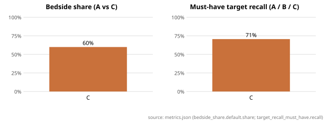

# Bedside Brief — evaluation report

Run: model `gpt-4.1`, git head `98f4c2e84844934cb33d102eb3b242f7d8ed0ba1`, frozen commits ['39a698e5e79a5b6eddebf090caa3f6c8a1b16f7b'], updated 2026-09-10T02:49:35+00:00.<!-- manifest.json -->
Provenance: every number below is followed by an HTML comment `<!-- file#json.path -->`; relative files resolve inside `eval/runs/armC_frozen`.

## Benchmark and store

- Cases: 36<!-- metrics.json#cases.base --> base, 36<!-- metrics.json#cases.perturbation_pairs --> perturbation pairs, 36<!-- metrics.json#cases.noise_variants --> noise variants (108<!-- metrics.json#cases.inputs --> inputs).
- Records: 0<!-- metrics.json#store.verified --> verified of 153<!-- metrics.json#store.extracted --> extracted; not-quantified share —<!-- metrics.json#store.not_quantified_share -->.
- Library coverage: 0.0%<!-- metrics.json#store.library_coverage.coverage --> (0<!-- metrics.json#store.library_coverage.mapped_to_verified --> of 258<!-- metrics.json#store.library_coverage.targets --> targets map to a verified record).

## Headline (A vs C)

| Metric | C Generic LLM |
|---|---|
| Bedside share [default] | 59.9%<!-- metrics.json#arms.C.bedside_share.default.share --> |
| Bedside share [ecg_bedside] | 64.4%<!-- metrics.json#arms.C.bedside_share.ecg_bedside.share --> |
| Bedside share [mar_offbedside] | 58.2%<!-- metrics.json#arms.C.bedside_share.mar_offbedside.share --> |
| Must-have target recall | 70.6%<!-- metrics.json#arms.C.target_recall_must_have.recall --> |
| &nbsp;&nbsp;must-have recall [quantified] | —<!-- metrics.json#arms.C.target_recall_must_have.strata.quantified.recall --> |
| &nbsp;&nbsp;must-have recall [not_quantified] | —<!-- metrics.json#arms.C.target_recall_must_have.strata.not_quantified.recall --> |
| &nbsp;&nbsp;must-have recall [unmapped] | 70.6%<!-- metrics.json#arms.C.target_recall_must_have.strata.unmapped.recall --> |
| Target recall (all) | 61.1%<!-- metrics.json#arms.C.target_recall_all.recall --> |
| Unsupported quantitative claim rate | 100.0%<!-- metrics.json#arms.C.unsupported_claim_rate.rate --> |
| &nbsp;&nbsp;performance numbers only | 100.0%<!-- metrics.json#arms.C.unsupported_claim_rate.performance_only.rate --> |
| Evidence fidelity (A/B) | —<!-- metrics.json#arms.C.evidence_fidelity.fidelity --> |
| Perturbation responsiveness | 41.7%<!-- metrics.json#arms.C.perturbation_responsiveness.rate --> |
| Noise stability (Jaccard) | 0.08<!-- metrics.json#arms.C.noise_stability.jaccard_mean --> |
| Brevity pass rate | 0.0%<!-- metrics.json#arms.C.brevity.pass_rate --> |
| should_not_recommend case hit rate | 13.9%<!-- metrics.json#arms.C.should_not_recommend.case_hit_rate --> |
| Ask-first correctness | 94.4%<!-- metrics.json#arms.C.ask_first.accuracy --> |
| Errors / outputs | 0<!-- metrics.json#arms.C.n_errors --> / 108<!-- metrics.json#arms.C.n_outputs --> |

## Figure

<!-- figure_bedside_share.svg <- metrics.json -->

## Full mechanical table

<!-- generated from metrics.json by eval.metrics.metrics_markdown -->
Inputs: 108 (36 base, 36 perturbation pairs, 36 noise variants). Store: 0 verified of 153 extracted; not-quantified share —; library coverage 0.0% (0/258 targets).

| Metric | C |
|---|---|
| Outputs (errors) | 108 (0) |
| Items per case (mean) | 28.213 |
| Bedside share [default] | 59.9% |
| Bedside share [ecg_bedside] | 64.4% |
| Bedside share [mar_offbedside] | 58.2% |
| Unclassified items | 493 |
| Target recall must_have | 70.6% |
|   must_have recall [quantified] (n) | — (0) |
|   must_have recall [not_quantified] (n) | — (0) |
|   must_have recall [unmapped] (n) | 70.6% (303) |
| Target recall all | 61.1% |
| Evidence fidelity (A/B) | — |
| Unsupported quantitative claim rate | 100.0% |
|   performance numbers only | 100.0% |
|   vs any verified record (lenient) | 100.0% |
| Perturbation responsiveness | 41.7% |
|   pairs explicit / fallback | 36 / 0 |
| Noise stability (Jaccard mean) | 0.085 |
| Brevity pass rate | 0.0% |
| should_not_recommend case hit rate | 13.9% |
| Ask-first correctness | 94.4% |

See `error_analysis.md` for the top failure modes of arm A.
