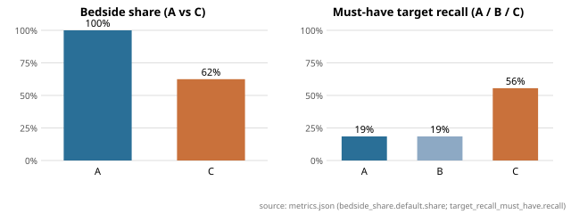

# Bedside Brief — evaluation report

Run: model `fake-model-smoke`, git head `206658adcdb540df394a209e5145d607403c2b41`, frozen commits ['39a698e5e79a5b6eddebf090caa3f6c8a1b16f7b'], updated 2026-09-11T08:43:23+00:00.<!-- manifest.json -->
Provenance: every number below is followed by an HTML comment `<!-- file#json.path -->`; relative files resolve inside `/home/user/bedside-brief/eval/runs/smoke_20260911_084322`.

## Benchmark and store

- Cases: 3<!-- metrics.json#cases.base --> base, 3<!-- metrics.json#cases.perturbation_pairs --> perturbation pairs, 3<!-- metrics.json#cases.noise_variants --> noise variants (9<!-- metrics.json#cases.inputs --> inputs).
- Records: 4<!-- metrics.json#store.verified --> verified of 153<!-- metrics.json#store.extracted --> extracted; not-quantified share 25.0%<!-- metrics.json#store.not_quantified_share -->.
- Library coverage: 19.0%<!-- metrics.json#store.library_coverage.coverage --> (4<!-- metrics.json#store.library_coverage.mapped_to_verified --> of 21<!-- metrics.json#store.library_coverage.targets --> targets map to a verified record).

## Headline (A vs C)

| Metric | A Bedside Brief | B Retrieval-only | C Generic LLM |
|---|---|---|---|
| Bedside share [default] | 100.0%<!-- metrics.json#arms.A.bedside_share.default.share --> | 100.0%<!-- metrics.json#arms.B.bedside_share.default.share --> | 62.5%<!-- metrics.json#arms.C.bedside_share.default.share --> |
| Bedside share [ecg_bedside] | 100.0%<!-- metrics.json#arms.A.bedside_share.ecg_bedside.share --> | 100.0%<!-- metrics.json#arms.B.bedside_share.ecg_bedside.share --> | 75.0%<!-- metrics.json#arms.C.bedside_share.ecg_bedside.share --> |
| Bedside share [mar_offbedside] | 100.0%<!-- metrics.json#arms.A.bedside_share.mar_offbedside.share --> | 100.0%<!-- metrics.json#arms.B.bedside_share.mar_offbedside.share --> | 62.5%<!-- metrics.json#arms.C.bedside_share.mar_offbedside.share --> |
| Must-have target recall | 18.5%<!-- metrics.json#arms.A.target_recall_must_have.recall --> | 18.5%<!-- metrics.json#arms.B.target_recall_must_have.recall --> | 55.6%<!-- metrics.json#arms.C.target_recall_must_have.recall --> |
| &nbsp;&nbsp;must-have recall [quantified] | 66.7%<!-- metrics.json#arms.A.target_recall_must_have.strata.quantified.recall --> | 66.7%<!-- metrics.json#arms.B.target_recall_must_have.strata.quantified.recall --> | 100.0%<!-- metrics.json#arms.C.target_recall_must_have.strata.quantified.recall --> |
| &nbsp;&nbsp;must-have recall [not_quantified] | 100.0%<!-- metrics.json#arms.A.target_recall_must_have.strata.not_quantified.recall --> | 100.0%<!-- metrics.json#arms.B.target_recall_must_have.strata.not_quantified.recall --> | 100.0%<!-- metrics.json#arms.C.target_recall_must_have.strata.not_quantified.recall --> |
| &nbsp;&nbsp;must-have recall [unmapped] | 0.0%<!-- metrics.json#arms.A.target_recall_must_have.strata.unmapped.recall --> | 0.0%<!-- metrics.json#arms.B.target_recall_must_have.strata.unmapped.recall --> | 42.9%<!-- metrics.json#arms.C.target_recall_must_have.strata.unmapped.recall --> |
| Target recall (all) | 20.6%<!-- metrics.json#arms.A.target_recall_all.recall --> | 20.6%<!-- metrics.json#arms.B.target_recall_all.recall --> | 42.9%<!-- metrics.json#arms.C.target_recall_all.recall --> |
| Unsupported quantitative claim rate | 0.0%<!-- metrics.json#arms.A.unsupported_claim_rate.rate --> | 0.0%<!-- metrics.json#arms.B.unsupported_claim_rate.rate --> | 71.4%<!-- metrics.json#arms.C.unsupported_claim_rate.rate --> |
| &nbsp;&nbsp;performance numbers only | 0.0%<!-- metrics.json#arms.A.unsupported_claim_rate.performance_only.rate --> | 0.0%<!-- metrics.json#arms.B.unsupported_claim_rate.performance_only.rate --> | 66.7%<!-- metrics.json#arms.C.unsupported_claim_rate.performance_only.rate --> |
| Evidence fidelity (A/B) | 100.0%<!-- metrics.json#arms.A.evidence_fidelity.fidelity --> | 100.0%<!-- metrics.json#arms.B.evidence_fidelity.fidelity --> | —<!-- metrics.json#arms.C.evidence_fidelity.fidelity --> |
| Perturbation responsiveness | 33.3%<!-- metrics.json#arms.A.perturbation_responsiveness.rate --> | 33.3%<!-- metrics.json#arms.B.perturbation_responsiveness.rate --> | 50.0%<!-- metrics.json#arms.C.perturbation_responsiveness.rate --> |
| Noise stability (Jaccard) | 1.00<!-- metrics.json#arms.A.noise_stability.jaccard_mean --> | 1.00<!-- metrics.json#arms.B.noise_stability.jaccard_mean --> | 1.00<!-- metrics.json#arms.C.noise_stability.jaccard_mean --> |
| Brevity pass rate | 100.0%<!-- metrics.json#arms.A.brevity.pass_rate --> | 100.0%<!-- metrics.json#arms.B.brevity.pass_rate --> | 100.0%<!-- metrics.json#arms.C.brevity.pass_rate --> |
| should_not_recommend case hit rate | 0.0%<!-- metrics.json#arms.A.should_not_recommend.case_hit_rate --> | 0.0%<!-- metrics.json#arms.B.should_not_recommend.case_hit_rate --> | 100.0%<!-- metrics.json#arms.C.should_not_recommend.case_hit_rate --> |
| Ask-first correctness | 100.0%<!-- metrics.json#arms.A.ask_first.accuracy --> | 100.0%<!-- metrics.json#arms.B.ask_first.accuracy --> | 100.0%<!-- metrics.json#arms.C.ask_first.accuracy --> |
| Errors / outputs | 0<!-- metrics.json#arms.A.n_errors --> / 9<!-- metrics.json#arms.A.n_outputs --> | 0<!-- metrics.json#arms.B.n_errors --> / 9<!-- metrics.json#arms.B.n_outputs --> | 0<!-- metrics.json#arms.C.n_errors --> / 9<!-- metrics.json#arms.C.n_outputs --> |

## Ablation (A vs B: does the LLM ranker earn its place?)

- Must-have recall A 18.5%<!-- metrics.json#arms.A.target_recall_must_have.recall --> vs B 18.5%<!-- metrics.json#arms.B.target_recall_must_have.recall -->.
- Bedside share A 100.0%<!-- metrics.json#arms.A.bedside_share.default.share --> vs B 100.0%<!-- metrics.json#arms.B.bedside_share.default.share --> (both render store records only).
- Noise stability A 1.00<!-- metrics.json#arms.A.noise_stability.jaccard_mean --> vs B 1.00<!-- metrics.json#arms.B.noise_stability.jaccard_mean -->.

## Figure

<!-- figure_bedside_share.svg <- metrics.json -->

## Full mechanical table

<!-- generated from metrics.json by eval.metrics.metrics_markdown -->
Inputs: 9 (3 base, 3 perturbation pairs, 3 noise variants). Store: 4 verified of 153 extracted; not-quantified share 25.0%; library coverage 19.0% (4/21 targets).

| Metric | A | B | C |
|---|---|---|---|
| Outputs (errors) | 9 (0) | 9 (0) | 9 (0) |
| Items per case (mean) | 2.333 | 2.333 | 8.000 |
| Bedside share [default] | 100.0% | 100.0% | 62.5% |
| Bedside share [ecg_bedside] | 100.0% | 100.0% | 75.0% |
| Bedside share [mar_offbedside] | 100.0% | 100.0% | 62.5% |
| Unclassified items | 0 | 0 | 0 |
| Target recall must_have | 18.5% | 18.5% | 55.6% |
|   must_have recall [quantified] (n) | 66.7% (3) | 66.7% (3) | 100.0% (3) |
|   must_have recall [not_quantified] (n) | 100.0% (3) | 100.0% (3) | 100.0% (3) |
|   must_have recall [unmapped] (n) | 0.0% (21) | 0.0% (21) | 42.9% (21) |
| Target recall all | 20.6% | 20.6% | 42.9% |
| Evidence fidelity (A/B) | 100.0% | 100.0% | — |
| Unsupported quantitative claim rate | 0.0% | 0.0% | 71.4% |
|   performance numbers only | 0.0% | 0.0% | 66.7% |
|   vs any verified record (lenient) | 0.0% | 0.0% | 42.9% |
| Perturbation responsiveness | 33.3% | 33.3% | 50.0% |
|   pairs explicit / fallback | 3 / 0 | 3 / 0 | 3 / 0 |
| Noise stability (Jaccard mean) | 1.000 | 1.000 | 1.000 |
| Brevity pass rate | 100.0% | 100.0% | 100.0% |
| should_not_recommend case hit rate | 0.0% | 0.0% | 100.0% |
| Ask-first correctness | 100.0% | 100.0% | 100.0% |

See `error_analysis.md` for the top failure modes of arm A.
